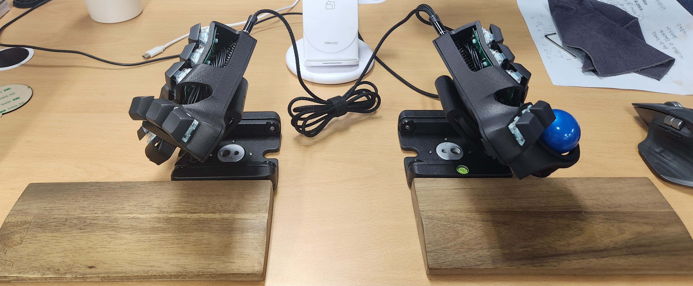

# Blackpill_charybdis_nano(BTU MODE, NO RGB)

# Part List
## 3d prints - cases
Look inside the "model" folder

## Components
### Keyboard
| Part name                         |  Amount  | Link                                                                                       |
| --------------------------------- | -------- | ------------------------------------------------------------------------------------------ |
| Flexible PCB for the plate (3x5)  | 2        | https://github.com/Bastardkb/Skeletyl-PCB-plate                                            |
| Flexible PCB for the thumbs       | 1        | https://github.com/Bastardkb/PCB_thumbs_Charybdis                                          |
| Flexible PCB for the thumbs (3x5) | 1        | https://github.com/Bastardkb/TBK-Mini-PCB-thumb-cluster                                    |
| SOD123 Diodes                     | 35       | https://ko.aliexpress.com/item/1005002882901030.html                                       |
| Cables                            | 30       | http://itempage3.auction.co.kr/DetailView.aspx?ItemNo=D505635839&frm3=V2                   |

The official recommended PCB thickness is 0.6 or 0.8.

### Controller
| Part name                         |  Amount  | Link                                                                                       |
| --------------------------------- | -------- | ------------------------------------------------------------------------------------------ |
| blackpill                         | 2        | https://ko.aliexpress.com/item/1005001456186625.html                                       |
| blackpill adapter                 | 2        | https://github.com/Bastardkb/adapter-blackpill/                                            |
| 1206 SMD Diodes 5.1k              | 6        | https://ko.aliexpress.com/item/1005004545215237.html                                       |
| M95640-WMN6TP EEPROM              | 2        | https://ko.aliexpress.com/item/4000014805924.html                                          |
| Audio jack, SMD                   | 2        | https://ko.aliexpress.com/item/1005001346205553.html                                       |
| Button, 4x4x1.5                   | 2        | https://ko.aliexpress.com/item/1005003918757433.html                                       |

EEPROM is required when using vial or rgb.

### Trackball
| Part name                         |  Amount  | Link                                                                                       |
| --------------------------------- | -------- | ------------------------------------------------------------------------------------------ |
| Sensor PCB                        | 1        | https://github.com/Bastardkb/charybdis-pmw-sensor                                          |
| PMW3360DM-T2QU                    | 1        | https://ko.aliexpress.com/item/4000904265601.html                                          |
| Screws, M3 8mm Torx               | 8        | https://ko.aliexpress.com/item/1005004048368746.html                                       |
| Screws, M3 12mm Torx              | 2        | https://ko.aliexpress.com/item/1005004048368746.html                                       |
| Heated screw insert, M3x5x5       | 5        | https://ko.aliexpress.com/item/1005004870993068.html                                       |
| Si3N4 2.5 or 3.0 or 3.175 ball    | 3        | https://ko.aliexpress.com/item/1005003610474605.html                                       |
| 34mm Trackball                    | 1        | anything you want                                                                          |

When using BTU mode, the bearing size must be checked before ordering Si3N4 bearings.

### Case
| Part name                         |  Amount  | Link                                                                                       |
| --------------------------------- | -------- | ------------------------------------------------------------------------------------------ |
| M4 8mm Torx Screw                 | 10       | https://ko.aliexpress.com/item/1005004048368746.html                                       |
| M4 screw insert, M4 X D6.0 X L5.0 | 8        | https://ko.aliexpress.com/item/1005004870993068.html                                       |
| Black 10x2mm bumpon               | 10       | https://ko.aliexpress.com/item/1005005287385986.html                                       |
