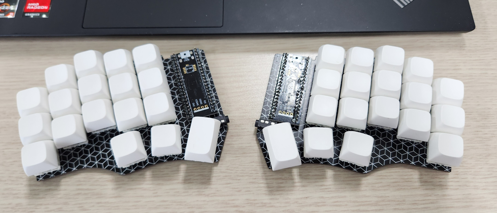

# Cantor Keyboard Remix MX Switch Version(36 keys)

## Changes
change to mx version

## Build Guide
Grab the `pcb/gerber.zip` and use your service of choice to order it! I used [JLCPCB](https://jlcpcb.com/), and there's a tag for them to print the order number in the silkscreen layer. 

pcb recommended thickness: 2 mm

### Bill of Materials

To build the keyboard, you will need the following materials:

- 2x PCB boards (both are equal since they are reversible)
- 2x STM32F401CC blackpill microcontrollers (they are cheap on aliexpress)
- Pins and sockets for the microcontrollers (blackpill needs 20 pin stripes)
- 36 MX switches
- 36 keycaps
- Some little rubber feet/bumpers (recommended 6 mm of diameter)
- 2x TRRS jacks (PJ-320A)
- 1x TRRS cable
- 1x USB cable compatible with your computer and the blackpill

Make sure to follow the original [Cantor Build Guide](https://github.com/diepala/cantor/blob/main/doc/build_guide.md). 

## Support Cantor
Consider supporting the original [Cantor](https://github.com/diepala/cantor)! Please refer to the original repository for more information.

